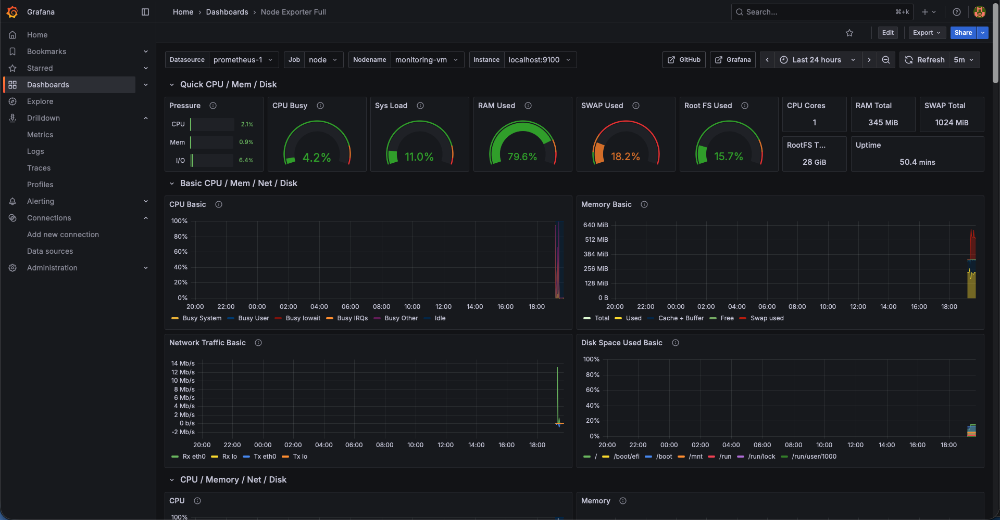

# Monitoring on Azure with Prometheus & Grafana

## Overview
This project sets up a **monitoring stack** on **Azure** using **Prometheus**, **Node Exporter** and **Grafana**.  
It collects and visualises system-level metrics (CPU, memory, disk usage) from an **Azure Linux VM**.  

The goal was to demonstrate how monitoring can be made **automated**, **scalable** and **observable**, rather than relying on manual checks or cloud-native metrics alone.

---

## Grafana Dashboard
A real-time visualisation of Azure VM performance using the **Node Exporter Full Dashboard (ID: 1860)** from Grafana Labs.  
This dashboard tracks CPU utilisation, memory, storage and network activity — giving instant visibility into system health.

---

## Tech Stack

---

## Project Structure
**azure-prometheus-grafana/**  
├─ **README.md**            - Project write-up  
├─ **.gitignore**           - Ignored files & folders  
├─ **screenshots/**         - Deployment walkthrough with images  
│   ├─ **DEPLOYMENT.md**    - Step-by-step setup documentation  

---

## Real-World Relevance
This project reflects real-world **DevOps observability practices**, where engineers monitor live infrastructure performance to ensure reliability and stability. It covers:
- **Exporters:** gathering system-level metrics  
- **Prometheus:** scraping and storing data  
- **Grafana:** visualising metrics through dashboards  
- **Azure Compute:** hosting the full stack in the cloud  

---

## Features
- Node Exporter installed on Azure Linux VM  
- Prometheus scrapes and stores system metrics  
- Grafana connected to Prometheus as a data source  
- Dashboard visualising CPU, memory and disk utilisation  
- Fully self-hosted monitoring stack on Azure  

---

## Deployment Steps
1. Provisioned an **Azure Linux VM**  
2. Installed **Node Exporter** to expose metrics on port `9100`  
3. Installed and configured **Prometheus** to scrape Node Exporter  
4. Installed **Grafana** and added Prometheus as a data source  
5. Imported a **Node Exporter Full Dashboard (ID: 1860)** from Grafana Labs  
6. Verified targets and dashboards displaying live metrics  

---

## Deployment Proof
Full step-by-step screenshots are available here:  
[View Deployment Walkthrough](./screenshots/DEPLOYMENT.md)
